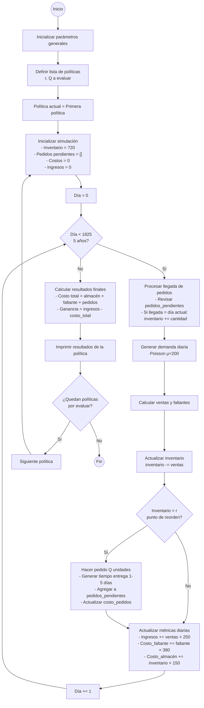

```mermaid
flowchart TD
    A((Inicio)) --> B[Inicializar parámetros generales]
    B --> C[Definir lista de políticas<br/>r, Q a evaluar]
    C --> D[Política actual = Primera política]
    
    D --> E["Inicializar simulación<br/>- Inventario = 720<br/>- Pedidos pendientes = []<br/>- Costos = 0<br/>- Ingresos = 0"]
    
    E --> F[Día = 0]
    F --> G{Día < 1825<br/>5 años?}
    
    G -->|Sí| H[Procesar llegada de pedidos<br/>- Revisar pedidos_pendientes<br/>- Si llegada = día actual:<br/>  inventario += cantidad]
    
    H --> I[Generar demanda diaria<br/>Poisson μ=200]
    
    I --> J[Calcular ventas y faltantes<br/>]
    
    J --> K[Actualizar inventario<br/>inventario -= ventas]
    
    K --> L{Inventario < r<br/>punto de reorden?}
    
    L -->|Sí| M[Hacer pedido Q unidades<br/>- Generar tiempo entrega 1-5 días<br/>- Agregar a pedidos_pendientes<br/>- Actualizar costo_pedidos]
    
    L -->|No| N[Actualizar métricas diarias<br/>- Ingresos += ventas × 250<br/>- Costo_faltante += faltante × 380<br/>- Costo_almacén += inventario × 150]
    
    M --> N
    
    N --> O[Día += 1]
    O --> G
    
    G -->|No| P[Calcular resultados finales<br/>- Costo total = almacén + faltante + pedidos<br/>- Ganancia = ingresos - costo_total]
    
    P --> Q[Imprimir resultados de la política]
    
    Q --> R{¿Quedan políticas<br/>por evaluar?}
    
    R -->|Sí| S[Siguiente política]
    S --> E
    
    R -->|No| T((Fin))
```
